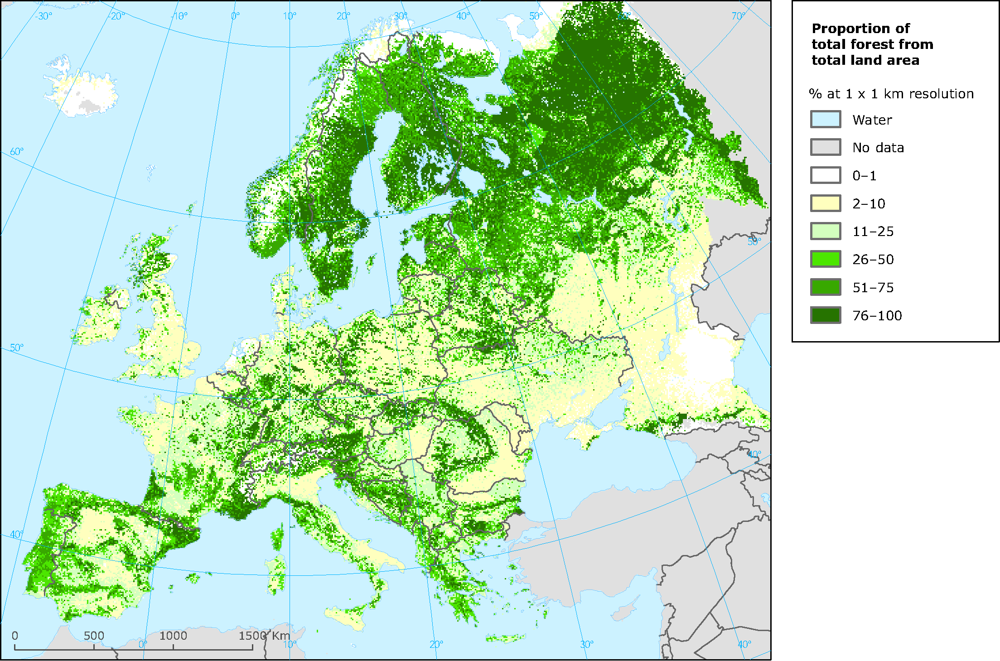
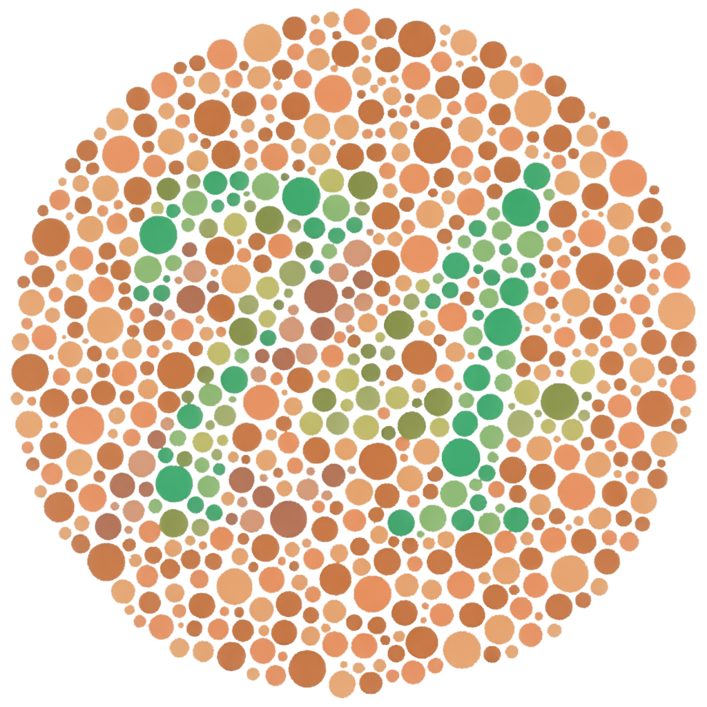

```{r setup, include = FALSE}
knitr::knit_hooks$set(crop = knitr::hook_pdfcrop)

knitr::opts_chunk$set(
  echo = TRUE,
  warning = FALSE,
  message = FALSE,
  cache = FALSE,
  dev = "png",
  fig.width = 4.8,
  fig.height = 4.1,
  fig.align = "center",
  fig.retina = 3,
  dev.args = list(pointsize = 16),
  crop = TRUE
)

library(tidyverse)
library(kableExtra)

kable <- function(x, ...) {
  knitr::kable(x, escape = FALSE, linesep = "", booktabs = TRUE)
}

library(RefManageR)
BibOptions(check.entries = FALSE, 
           bib.style = "authoryear",
           style = "markdown",
           dashed = TRUE)
bib <- ReadBib("assets/references.bib")

if (!interactive()) {
  theme_set(theme_grey(base_size = 16))
}

options(digits = 3)
```

## Color in Visualizations

How do we choose colors appropriately?

need to pay attention to data type!

--

.pull-left[
### Sequential Palette

```{r, echo = FALSE, fig.width = 5, fig.height = 0.5}
library(RColorBrewer)
par(mai = c(0, 0, 0, 0))
image(
  1:8,
  1,
  as.matrix(1:8),
  col = brewer.pal(8, "YlOrRd"),
  xlab = "",
  ylab = "",
  xaxt = "n",
  yaxt = "n",
  bty = "n"
)
```

imply order among values

### Qualitative Palette

```{r, echo = FALSE, fig.width = 5, fig.height = 0.5}
par(mai = c(0, 0, 0, 0))
image(
  1:8,
  1,
  as.matrix(1:8),
  col = brewer.pal(8, "Accent"),
  xlab = "",
  ylab = "",
  xaxt = "n",
  yaxt = "n",
  bty = "n"
)
```

imply no ordering
]

.pull-right[
### Diverging Palette

```{r, echo = FALSE, fig.width = 5, fig.height = 0.5}
par(mai = c(0, 0, 0, 0))
image(
  1:11,
  1,
  as.matrix(1:11),
  col = brewer.pal(11, "RdBu"),
  xlab = "",
  ylab = "",
  xaxt = "n",
  yaxt = "n",
  bty = "n"
)
```

emphasis on low, mid, and high ends
]

---

## Natural Color Mappings

the type of data sometimes implies a natural color mapping: temperature, geographical features,
political affiliation

```{r, out.width = "70%", echo = FALSE, fig.cap = "Forest cover in Europe (www.eea.europa.eu)."}

```


---

## ggplot2

ggplot2 tries to **guess** which color palette to use

- ordinal and numerical variables are mapped to a **sequential** palette
- unordered categorical variables are mapped to a **qualitative** palette

but ggplot2 never knows when to map a variable a **diverging** palette, or which
direction of values indicate strongest intensity

--

### Applying a Color Palette in ggplot2

- `scale_colour_*` for color mappings (`geom_point()`, `geom_line()` etc)
- `scale_fill_*` for fill mappings (`geom_col()`, `geom_tile()` etc etc)

---

## Sequential Palettes

typically used for data that is ordered from low to high

varying lightness

**examples:** population count, quality rating, size

```{r, fig.width = 9, fig.height = 3.8}
ggplot(diamonds, aes(price, fill = cut)) +
  geom_histogram(binwidth = 1000) +
  scale_fill_ordinal() #<<
```

---

## Diverging Palettes

equal emphasis on middle and low and high ends of scale

`scale_fill/color_gradient2()` in ggplot2

**examples:** temperature (celsius), budget balance, correlations

```{r, echo = FALSE}
mtcars_cor <- 
  cor(select(mtcars, mpg, disp, hp, drat, wt, qsec)) %>%
  as.data.frame() %>%
  rownames_to_column("var1") %>%
  pivot_longer(mpg:qsec, names_to = "var2", values_to = "cor")
```

.pull-left[
```{r corplot, eval = FALSE}
# see source for dataset
mtcars_cor %>%
  ggplot(aes(var1, 
             var2, 
             fill = cor)) +
  geom_tile() +
  scale_fill_gradient2() + #<<
  labs(x = NULL, y = NULL)
```
]

.pull-right[
```{r, ref.label = "corplot", fig.cap = "Heatmap of correlation matrix.", echo = FALSE}

```

]


---

## Qualitative Palettes

colors should be as distinct as possible and not signal differences in magnitude

**examples:** political party affiliation, gender

```{r, fig.width = 8, fig.height = 4}
ggplot(msleep, aes(bodywt, sleep_total, color = vore)) +
  geom_point() +
  scale_x_log10() +
  scale_color_discrete() #<<
```


---

## Color Blindness

.pull-left[
red-green color blindness affects 8% of men and 0.5% of females<sup>1</sup>

several different types: 

- protanotopia
- deuteranopia
- protanomaly 
- deuteranomaly
- tritanopia
- tritanomaly
]

.pull-right[
```{r, echo = FALSE, fig.cap = "Ishihara color test. What number do you see? (en.wikipedia.org/wiki/Color_blindness)"}

```

]

.footnote[
<sup>1</sup> Of people of Northern European descent.
]

---

### Simulating Color Blindness

```{r, fig.width = 10, fig.height = 6}
library(colorBlindness)

p <- ggplot(mpg, aes(hwy, fill = drv)) + geom_density(alpha = 0.5)
cvdPlot(p)  #<<
```

---

## ColorBrewer

based on work on color use in maps `r Citep(bib, "harrower2003")` but applicable to
most types of plots

sequential, diverging, and qualitative palettes, many tailored to individuals
with color blindness

requires [RColorBrewer](https://CRAN.R-project.org/package=RColorBrewer) package

.pull-left[
`scale_color_brewer()`: discrete (integer, categorical) data 

`scale_color_distiller()`: continuous data

```{r brewerplot, eval = FALSE}
p + 
  scale_fill_brewer(
    palette = "Accent"
  )
```

]

.pull-right[
```{r, ref.label = "brewerplot", echo = FALSE}
```

]

---

```{r, fig.cap = "All the palettes in ColorBrewer.", fig.width = 10, fig.height = 10, echo = FALSE}
library(RColorBrewer)
display.brewer.all()
```

---

## Viridis

**sequential** palettes created by Stéfan van der Walt and Nathaniel Smith for the 
Python matplotlib library

perceptually uniform and great for individuals with color blindness

requires [viridis](https://CRAN.R-project.org/package=viridis) 
(or [viridisLite](https://CRAN.R-project.org/package=viridisLite))

.pull-left[
- `scale_viridis_c`: continuous data
- `scale_viridis_d`: discrete data

```{r viridisplot, eval = FALSE}
tibble(x = rnorm(1e4), 
       y = rnorm(1e4)) %>%
  ggplot(aes(x, y)) +
  geom_hex() + 
  scale_fill_viridis_c() + #<<
  coord_fixed()
```
]

.pull-right[
```{r ref.label = "viridisplot", echo = FALSE}
```
]

---

```{r, fig.show = "hold", fig.width = 8, fig.height = 1.4, echo = FALSE, crop = NULL, fig.cap = "Palettes from the viridis package."}
library(viridisLite)
par(mai = c(0, 0, 0.5, 0))
image(
  1:8,
  1,
  as.matrix(1:8),
  col = viridis(8),
  xlab = "",
  ylab = "",
  xaxt = "n",
  yaxt = "n",
  bty = "n",
  main = "viridis"
)
image(
  1:8,
  1,
  as.matrix(1:8),
  col = magma(8),
  xlab = "",
  ylab = "",
  xaxt = "n",
  yaxt = "n",
  bty = "n",
  main = "magma"
)
image(
  1:8,
  1,
  as.matrix(1:8),
  col = inferno(8),
  xlab = "",
  ylab = "",
  xaxt = "n",
  yaxt = "n",
  bty = "n",
  main = "inferno"
)
image(
  1:8,
  1,
  as.matrix(1:8),
  col = plasma(8),
  xlab = "",
  ylab = "",
  xaxt = "n",
  yaxt = "n",
  bty = "n",
  main = "plasma"
)
image(
  1:8,
  1,
  as.matrix(1:8),
  col = cividis(8),
  xlab = "",
  ylab = "",
  xaxt = "n",
  yaxt = "n",
  bty = "n",
  main = "cividis"
)
```

---

## Other Considerations

### Greyscale

color visualizations are still sometimes printed in greyscale; may be a good idea to
use palettes that vary lightness

```{r, echo = FALSE, fig.width = 10, fig.height = 4, fig.cap = "The same plot in original colors and greyscale."}
library(colorBlindness)

p <- ggplot(mpg, aes(drv, fill = factor(cyl))) +
  geom_bar()
cvdPlot(p, c("origin", "desaturate"))
```

---

### Aesthetics

**subjective** and **fickle** but still important to consider

beautiful visualizations will always attract more attention

```{r, echo = FALSE, fig.width = 10, fig.cap = "Which would you prefer?", fig.height = 5}
library(gridExtra)

p1 <- ggplot(faithful, aes(eruptions, waiting)) +
  geom_density_2d_filled() + 
  theme(legend.position = "none")

cols <- colorRampPalette(c("green", "brown"))(13)
p2 <- p1 + scale_fill_manual(values = cols)
grid.arrange(p1, p2, ncol = 2)
```


---

## References

```{r, results = "asis", echo=FALSE}
PrintBibliography(bib)
```
