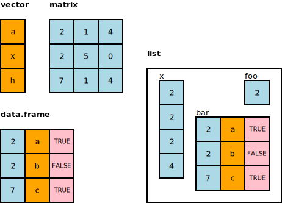

```{r setup, include = FALSE}
knitr::knit_hooks$set(crop = knitr::hook_pdfcrop)

knitr::opts_chunk$set(
  echo = TRUE,
  warning = FALSE,
  message = FALSE,
  cache = FALSE,
  dev = "png",
  fig.width = 5,
  fig.height = 4.3,
  fig.align = "center",
  fig.retina = 3,
  dev.args = list(pointsize = 16),
  crop = TRUE
)

library(tidyverse)
library(tactile)
library(lattice)
library(latticeExtra)
library(kableExtra)

kable <- function(x, ...) {
  knitr::kable(x, escape = FALSE, linesep = "", booktabs = TRUE)
}

library(RefManageR)
BibOptions(check.entries = FALSE,
           bib.style = "authoryear",
           style = "markdown",
           dashed = TRUE)
bib <- ReadBib("assets/references.bib")

if (!interactive()) {
  theme_set(theme_grey(base_size = 16))
}

xaringanExtra::use_search(show_icon = TRUE)

options(digits = 3)
```

## R

.pull-left[
* a programming language **and** piece of software
* designed for **statistical** applications
* stable
* extensive ecosystem of packages
* **excellent** facilities for visualization
]

.pull-right[
```{r, out.width = "70%", echo = FALSE}
knitr::include_graphics("images/r-logo.png")
```
]

### Code in R

```{r, echo = TRUE}
x <- c(1, 2)
mean(x)
```


---

## R Studio

.pull-left[
* graphical user interface for R
* combines text editor, console, and plot window
* useful for organizing projects
* for this course, we **assume** that you will be using R studio
]

.pull-right[
```{r, out.width = "90%", echo = FALSE}
knitr::include_graphics("images/rstudio.png")
```
]

---

background-image: url("images/rstudio-screenshot.png")
background-size: contain

---

background-image: url("images/rstudio-screenshot-editor.png")
background-size: contain

---

background-image: url("images/rstudio-screenshot-console.png")
background-size: contain

---

background-image: url("images/rstudio-screenshot-plot.png")
background-size: contain

---

## Everything in R is an Object

use the `<-` operator to assign values from the right-hand to the left-hand
side

```{r, echo = TRUE}
x <- c(1, 9)
x
```

objects can be copied or modified in place

```{r, echo = TRUE}
# copy the contents of x to create a new variable y
y <- x

# replace the first element of y
y[1] <- 10
y
```

---

## Data Classes in R

represents the type of storage

* **numeric**: quantitative data
* **logical**: yes or no
* **character**: nominal data

```{r, echo = TRUE}
x <- c(0.1, 0.2)     # numeric
y <- c(TRUE, FALSE)  # logical
z <- c("foo", "bar") # character
```

--

other types of classes exist: **integer**, **double**, and **factor**, but
are not (very) important for us

---

## Data Structures in R

objects of the various **data classes** may be stored into
**data structures**, such as

* **vector**: one-dimensional list
* **matrix**: two-dimensional table; elements must have **same** data class
* **data.frame**: two-dimensional table; elements can have **different** data
  classes
* **list**: list of items (data frames, matrices, vectors) of potentially
  different lengths.

---

class: center, middle

```{r, out.width = "90%", echo = FALSE}

```

---

### Vectors

all elements must be of the same type

can be constructed using `c()`

```{r, echo = TRUE}
c(1.3, 4, 5)         # numeric
c(TRUE, FALSE, TRUE) # logical
c("apple", "pear")   # character
c(1, "3", TRUE)      # mix (converted to character)
```

---

### Accessing Elements in Vectors

access with `[` operator

```{r, echo = TRUE}
x <- c("a", "b", "c")
x[1] # access first element
```

--

access several elements by indexing with vector of integers

```{r, echo = TRUE}
x[c(1, 2)] # or x[1:2]
```

---

### Matrices

create matrices with `matrix()`, `cbind()`, and `rbind()`

```{r, echo = TRUE}
A <- cbind(c(1, 2), c(2, 3)) # numeric matrix
A
```

--

access elements, rows, and columns using `[` operator

```{r, echo = TRUE}
A[2, 2]  # lower right element
A[1, ]   # first row, A[, 2] accesses second column
```

---

### Data Frames

like matrices, but columns may have different classes

```{r, echo = TRUE}
d <- data.frame(x = c(1, 2),
                y = c("apple", "pear"))
d
```

--

access using `[` or `$` operator

```{r, echo = TRUE}
d[, 1] # first column (x)
d$x    # same as above!
```

---

### Lists

a collection of objects of **any kind** (of any dimensions)

```{r, echo = TRUE}
# <name> = <element> syntax
x <- list(a = c("foo", "bar"),
          b = matrix(1:4, 2, 2))
x
```

--

a data frame is in fact a special type of list

---

## Functions

Everything that happens in R is the result of a function call.

--

```{r, echo = TRUE}
my_function <- function(x, y) {
  x + 2*y
}

my_function(1, 3)
```

--

- `x` and `y` are the **arguments**

--

- `x + 2*y` is the **body**

--

- the last line of the function decides what the function returns,
  unless `return()` is used somewhere inside the function

---

### Arguments

Arguments can be specified either by **name** or by **location**.

```{r, echo = TRUE}
my_function(3, 1)         # by location
my_function(y = 1, x = 3) # by name
```

--

In `my_function()`, both arguments are **mandatory**, but this is not
always the case. Here we let give `y` a **default** value.

```{r, echo = TRUE}
my_other_function <- function(x, y = 3) {
  x + 2*y
}

my_other_function(1)
```

---

### Functions in This Course

- We won't be writing our own function in this course.

--

- But it is important to understand how to
  * call functions,
  * read function documentation, and
  * figure out what a function's default arguments imply.

---

## Packages

more than 16,000 packages on [CRAN](https://cran.r-project.org/web/packages/)

easy to install!

```{r eval = FALSE}
install.packages("ggplot2")
```

load the package by calling `library()`

```{r eval = FALSE}
library(ggplot2)
```

--

even more packages available via [bioconductor](https://www.bioconductor.org) and
git repositories on [github](https://github.com/) and similar sites.

```{r eval = FALSE}
# install.packages("remotes")
remotes::install_github("hrbrmstr/waffle")
```

But in this course we will **only** use CRAN packages

---

## Getting Help

- Learn how to read object documentation, particularly for functions.
  * `F1` shortcut in R Studio
  * `help(function)` or `?function` in console

- Most problems you run into have been encountered (and solved)
  by others. Use
  * the course discussion board,
  * [stack overflow](https://stackoverflow.com/) (tag `r`), or
  * a search engine.
