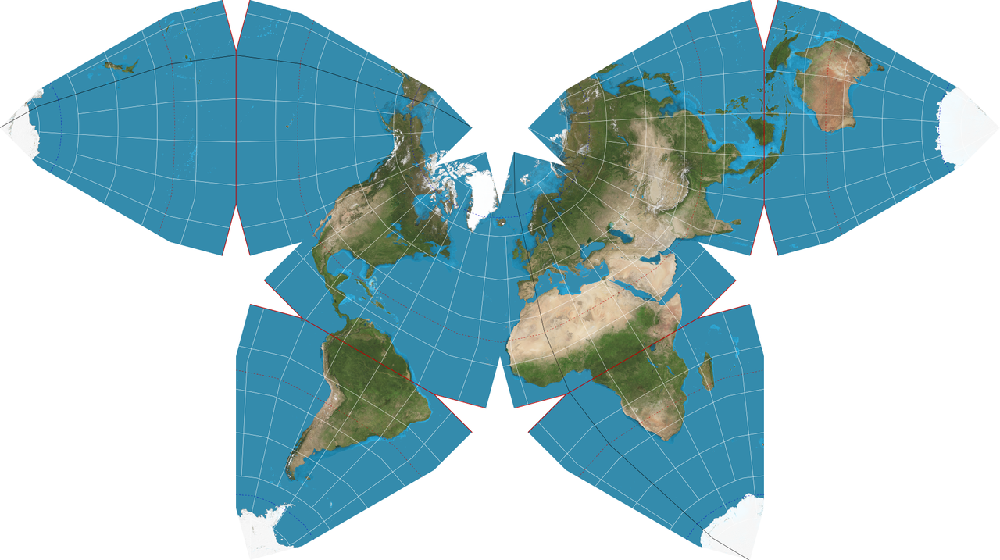

```{r setup, include = FALSE}
knitr::knit_hooks$set(crop = knitr::hook_pdfcrop)

knitr::opts_chunk$set(
  echo = TRUE,
  warning = FALSE,
  message = FALSE,
  cache = FALSE,
  dev = "png",
  fig.width = 4.8,
  fig.height = 4.1,
  fig.align = "center",
  fig.retina = 3,
  dev.args = list(pointsize = 16),
  crop = TRUE
)

library(tidyverse)
library(kableExtra)

kable <- function(x, ...) {
  knitr::kable(x, escape = FALSE, linesep = "", booktabs = TRUE)
}

library(RefManageR)
BibOptions(check.entries = FALSE, 
           bib.style = "authoryear",
           style = "markdown",
           dashed = TRUE)
bib <- ReadBib("assets/references.bib")

if (!interactive()) {
  theme_set(theme_grey(base_size = 16))
}

#xaringanExtra::use_search(show_icon = TRUE)

options(digits = 3)
```

## Maps

Data in the wild is often **spatial** in nature.

If you find spatial data, your first urge should be to map it!

### Themes for Maps

The default ggplot2 theme is not suitable for maps.

```{r, eval = FALSE}
library(tidyverse)

theme_set(theme_void())
```

`theme_bw()` is also a good choice, particularly if you need coordinates.

```{r, echo = FALSE}
theme_set(theme_void(base_size = 15))
```

---

## Mapping with ggplot2: Two Methods

### 1. Native ggplot2

- `geom_polygon()` and `coord_map()`
- no external dependencies
- fine for simple maps

--

.pull-left[
### 2. Simple Features

What we will use instead

- `geom_sf()` and `coord_sf()`
- much more powerful
- heavy-lifting done by the [sf](https://cran.r-project.org/package=sf) package
]

.pull-right[
```{r, out.width = "100%", echo = FALSE}
knitr::include_graphics("images/simple-features.jpg")
```
]

---

## Hello World!

```{r, fig.width = 10, fig.height = 8}
library(rnaturalearth)
world <- ne_countries(returnclass = "sf")

ggplot(world) +
  geom_sf(fill = "black", col = "white")
```

---

## Spatial Data

Maps are nice in and by themselves, but what we're really looking for
is to visualize some data.

.pull-left[
### Forms of Spatial Data

- vector (polygon) data
- point (coordinate) data
- raster data

Visualizations can combine these types however you like.
]

.pull-right[
```{r, out.width = "100%", echo = FALSE}
knitr::include_graphics("images/raster-vector-data.png")
```
]

---

## Vector Data

We often have separate data sources: one for the map and one for the data of interest.

We often need to merge these data sets together.

Simple features are compatible with most tidyverse operations: `filter()`,
`select()`, `mutate()`, `group_by()`, `*_join()` etc.

--

### Example: Crime Data in US states from 1974

```{r}
# map data
usa <- ne_states(iso_a2 = "US", returnclass = "sf") %>%
  filter(!(postal %in% c("AK", "HI")))

# data of interest
arr <- as_tibble(USArrests, rownames = "region")

# merge the simple features map with the data
usa_arr <- left_join(usa, arr, by = c("gn_name" = "region"))
```

---

### Choropleths

Mapping to fill color produces a **choropleth**.

```{r, fig.height = 5, fig.width = 9}
ggplot(usa_arr, aes(fill = Murder)) +
  geom_sf(col = "white") +
  scale_fill_distiller(direction = 1, palette = "Reds")
```

It is easy to read, but the area of the region influences the visual impression.

---

### Choropleth Alternatives

We can use **sf** package to get centroid of each state and plot bubbles

```{r, fig.height = 5, fig.width = 9}
centroids <- sf::st_centroid(usa_arr)

ggplot(usa) +
  geom_sf(col = "white") +
  geom_sf(aes(size = Murder), data = centroids) 
```

It is harder to read, but the visual impression is no longer influenced by area.

---

## Point Data

longitude (x-axis coordinates) and latitude (y-axis coordinates)

```{r}
airports_raw <- read_tsv(
  paste0("https://github.com/stat-lu/dataviz/",
         "raw/main/data/airports.txt"), 
  col_names = TRUE
)
```

If we want to be able to use projections, we need to convert this
data to a simple features object.

```{r}
library(sf)

airports <- st_as_sf(
  airports_raw,
  coords = c("Longitude", "Latitude"),
  crs = 4326 # use this if you have longitude and latitudes
)
```

.footnote[
Original data is from <https://slcladal.github.io/data/airports.txt>.
]

---

### Stacking Layers

It is easy to stack layers of different geometries (here: polygons and points).

```{r, fig.width = 10, fig.height = 8}
ggplot() +
  geom_sf(data = world, col = "white") +
  geom_sf(data = airports, cex = 0.1)
```

---

### Airports in Skåne

<ol>
<li> filter the data
</ol>

```{r}
skane_map <- ne_states("Sweden", returnclass = "sf") %>%
  filter(name == "Skåne")

# filter out only airports in skåne (using st_intersection)
airports_sweden <- filter(airports, Country == "Sweden")
skane_air <- st_intersection(airports_sweden, skane_map)
```

--

.pull-left[
<ol start = 2> 
<li> plot it!
</ol>

```{r skane_empty, eval = FALSE}
p <- ggplot(skane_map) +
  geom_sf(col = "white") +
  geom_sf(data = skane_air)

p
```
]

.pull-right[
```{r ref.label = "skane_empty", echo = FALSE, fig.width = 3.5}
```
]

---

### Adding Text Labels

Let's add some labels too!

.pull-left[
```{r skane_labels, eval = FALSE}
library(ggrepel)

p + 
  geom_sf_label(
    aes(label = Name),
    data = skane_air,
    nudge_y = 0.06,
    nudge_x = 0.2
  )
```
]

.pull-right[
```{r ref.label = "skane_labels", echo = FALSE}
```
]

---

## Raster Data

Raster data is common in many areas, such as street map or terrain data.

The [ggmap](https://CRAN.R-project.org/package=ggmap) package pulls raster map data from
[Stamen Maps](http://maps.stamen.com) and [Google Maps](https://maps.google.com).

.pull-left[
```{r houston, eval = FALSE}
library(ggmap)

bbox <- c(
  left   = -95.39681, 
  right  = -95.34188, 
  bottom = 29.73631, 
  top    = 29.78400
)

map <- get_stadiamap(
  bbox, 
  maptype = "stamen_toner", 
  zoom = 14
)

ggmap(map)
```
]

.pull-right[
```{r ref.label = "houston", echo = FALSE}
```
]

---

### Crime in Houston

```{r}
robberies <- filter(crime, offense == "robbery")
```

Stacking layers on raster maps is also easy.

.pull-left[
```{r houston-crime, eval = FALSE}
houston_plot <- 
  ggmap(map) +
  geom_point(
    aes(lon, lat), 
    col = "firebrick",
    alpha = 0.5,
    data = robberies
  )

houston_plot
```
]

.pull-right[
```{r ref.label = "houston-crime", echo = FALSE}
```
]

---

### Crime in Houston: 2D Density Layer

.pull-left[
```{r houston-crime-dens, eval = FALSE}
houston_plot +
  geom_density_2d_filled(
    aes(lon, lat), 
    alpha = 0.5,
    data = robberies,
    show.legend = FALSE
  ) +
  scale_fill_brewer(
    palette = "YlOrRd",
    direction = 1
  )
```
]

.pull-right[
```{r, ref.label = "houston-crime-dens", echo = FALSE}
```

]

.footnote[
This example was adapted from <https://github.com/dkahle/ggmap/>.
]

---

## Geocoding (Address Data)

Geocoding converts addresses or names of places into **coordinates**.

Many options are available; here we use the
[tidygeocoder package](https://CRAN.R-project.org/package=tidygeocoder):

```{r, fig.width = 6, fig.height = 3.5}
lu <- tidygeocoder::geo("Lund University, Sweden") #<<
```

.pull-left[
```{r lu-map, eval = FALSE}
lu_sf <- st_as_sf(
  lu, 
  coords = c("long", "lat"),
  crs = 4326
)

ggplot(skane_map) +
  geom_sf() +
  geom_sf(
    data = lu_sf,
    cex = 3,
    col = "firebrick1"
  )
```
]

.pull-right[
```{r ref.label = "lu-map", echo = FALSE, fig.width = 4.5}
```
]

---

## Projections

The only truly accurate representation of the earth is as a **sphere**.

We need to **project** this spherical surface onto a plane.

.pull-left[
This leads to **distortions**
in one (or several) of the following aspects:

- areas
- shapes
- directions
- distances

The larger the scale of the map is, the worse the distortion becomes.

Every map projection is a compromise.
]

.pull-right[
```{r, echo = FALSE, out.width = "100%", fig.cap = "Tissot's indicatrices on the Mercator Projection of the world map."}
knitr::include_graphics("images/mercator-tissot.png")
```

]

---

### Projections With ggplot2 and sf

Simplest approach is to find the EPSG code for the projection you want at
<https://epsg.io/>.

- copy-paste the first line, for instance "ESRI:54016" for the World Gall
  Stereographic projection
- add `coord_sf(crs = sf::st_crs("ESRI:54016"))` to the ggplot2 call

```{r}
# base map
# default projection: WGS84 (x = longitude, y = latitude)
world_map <- 
  world %>%
  filter(continent != "Antarctica") %>%
  ggplot() +
  geom_sf() +
  theme_bw()
```

---

### Conformal

- preserves angles (shapes) locally

```{r, fig.width = 7, fig.height = 4, fig.cap = "Mercator"}
library(sf) # for st_crs
world_map + coord_sf(crs = st_crs("EPSG:3857"))
```

---

### Equal-Area

- preserves area measure

```{r, fig.width = 10, fig.height = 4, fig.cap = "Mollweide"}
world_map + coord_sf(crs = st_crs("ESRI:54009"))
```

---

### Equidistant

- preserves distance between any two points

```{r, fig.width = 5, fig.height = 6, fig.cap = "Azimuthal Equidistant"}
world_map + coord_sf(crs = st_crs("ESRI:54032"))
```

---


### Compromises

- tries to compromise distortions among the various aspects

```{r, fig.width = 10, fig.height = 4, fig.cap = "Robinson"}
world_map + coord_sf(crs = st_crs("ESRI:54030"))
```

---

### More Projections

See <https://en.wikipedia.org/wiki/List_of_map_projections> for an exhaustive
list of different map projections.

Many projections have parameters that allow fine-grained control, but this is
beyond the scope here.

```{r, fig.cap = "The Waterman Butterfly Projection. A compromise projection.", out.width = "70%", echo = FALSE}

```

<!-- --- -->

<!-- ## References -->


<!-- ```{r, results = "asis", echo=FALSE} -->
<!-- PrintBibliography(bib) -->
<!-- ``` -->
