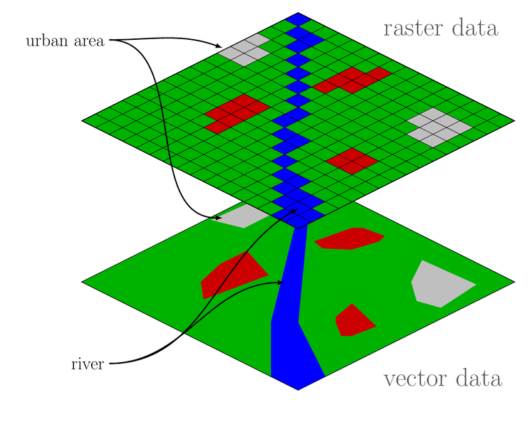
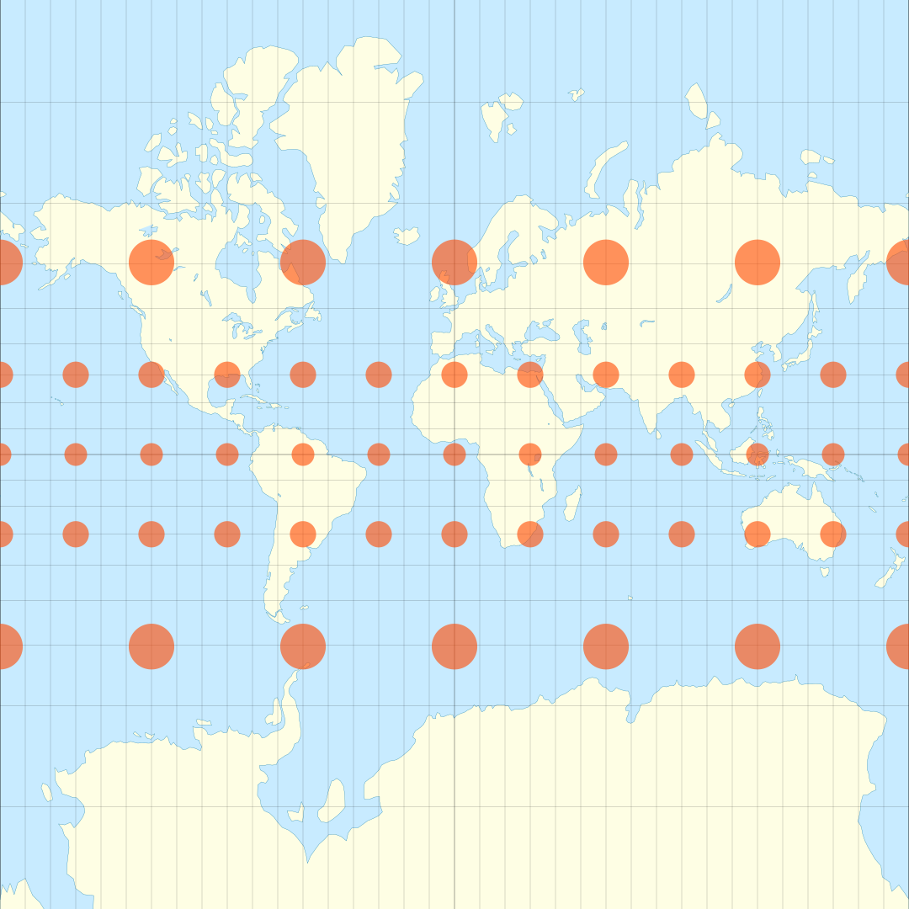

```{r setup, include = FALSE}
knitr::knit_hooks$set(crop = knitr::hook_pdfcrop)

knitr::opts_chunk$set(
  echo = TRUE,
  warning = FALSE,
  message = FALSE,
  cache = FALSE,
  dev = "png",
  fig.width = 4.8,
  fig.height = 4.1,
  fig.align = "center",
  fig.retina = 3,
  dev.args = list(pointsize = 16),
  crop = TRUE
)

library(tidyverse)
library(kableExtra)

kable <- function(x, ...) {
  knitr::kable(x, escape = FALSE, linesep = "", booktabs = TRUE)
}

library(RefManageR)
BibOptions(check.entries = FALSE, 
           bib.style = "authoryear",
           style = "markdown",
           dashed = TRUE)
bib <- ReadBib("assets/references.bib")

if (!interactive()) {
  theme_set(theme_grey(base_size = 16))
}

xaringanExtra::use_search(show_icon = TRUE)

options(digits = 3)
```

## Maps

Data in the wild is often **spatial** in nature.

Basic functionality for working with maps is available directly in **ggplot2**.

For more advanced functionality, we need to involve other packages (and ggplot in fact
relies on some of them for features such as map projections).

typically a good idea to go for a minimalist theme when mapping

```{r, eval = FALSE}
library(tidyverse)
theme_set(theme_void())
```

```{r, echo = FALSE}
theme_set(theme_void(base_size = 15))
```

---

## Simple Maps

`map_data()` converts various objects to data that ggplot can use and 
offers a simple interface to the [maps](https://CRAN.R-project.org/package=maps)
package.

```{r, fig.width = 8, fig.height = 6}
world <- map_data("world")
ggplot(world, aes(long, lat, group = group)) +
  geom_polygon() +
  coord_map(xlim = c(-180, 180), ylim = c(-52, 83.6))
```

---

## Spatial Data

Maps are nice in and by themselves, but what we're really looking for
is to visualize some data.

.pull-left[
Spatial data comes in different forms:

- vector (polygon) data
- point (coordinate) data
- raster data

These different types of data can (and often need to be) combined.
]

.pull-right[
```{r, out.width = "100%", echo = FALSE}

```
]

---

## Vector Data

**example:** crime data from USA states from 1974

```{r}
usa <- map_data("state")
arr <- as_tibble(USArrests, rownames = "region") %>%
  mutate(region = tolower(region))

usa_arr <- left_join(usa, arr)
```

```{r, echo = FALSE}
head(usa_arr) %>%
  kbl() %>%
  kable_styling(font_size = 20)
```

---

### Choropleths

Mapping to fill color produces a **choropleth**.

```{r, fig.height = 5, fig.width = 8}
ggplot(usa_arr, aes(long, lat, group = group, fill = Murder)) +
  geom_polygon() +
  scale_fill_distiller(direction = 1, palette = "Reds") +
  coord_map()
```

**problem:** state area influence impression of effect!

---

## Point Data

coordinates (longitude and latitude)

```{r}
airports <- read_tsv(
  "https://slcladal.github.io/data/airports.txt", 
  col_names = TRUE
)
```

```{r, echo = FALSE}
head(airports, 4) %>%
  kbl() %>%
  kable_styling(font_size = 20)
```

---

one possibility: just plot the points

```{r, fig.width = 8, fig.height = 5}
ggplot(airports, aes(Longitude, Latitude)) +
  geom_point(cex = 0.1, alpha = 0.5) +
  coord_map()
```

---

but we might also want to include the geography

```{r, fig.width = 8, fig.height = 5}
ggplot() +
  geom_polygon(aes(long, lat, group = group), 
               fill = "grey", data = world) +
  geom_point(aes(Longitude, Latitude), 
             cex = 0.1, data = airports) +
  coord_map(xlim = c(-180, 180), ylim = c(-52, 83.6))
```

---

### Adding Layers

Points do not always suffice by themselves in revealing patterns.

```{r}
ger_map <- filter(world, region == "Germany")
ger_air <- filter(airports, 
                  Country == "Germany", 
                  Longitude > 5, Latitude < 57)
```

--

.pull-left[
```{r vanillager, eval = FALSE}
p <- ggplot(
  ger_air, 
  aes(Longitude, Latitude)
) +
  geom_polygon(
    aes(long, 
        lat, 
        group = group), 
    inherit.aes = FALSE, 
    fill = "gray", 
    data = ger_map
  ) +
  coord_map()
p
```
]

.pull-right[
```{r ref.label = "vanillager", echo = FALSE, fig.width = 3.2}
```

]

---

adding density estimates with contour lines and color

```{r gerplot, fig.width = 5.5, fig.height = 6.5}
p +
  geom_density_2d_filled(alpha = 0.25) + #<<
  geom_density_2d(col = 1) + #<<
  geom_point()
```

---

## Raster Data

Raster data is common in many areas, such as street map or terrain data.

The [ggmap](https://CRAN.R-project.org/package=ggmap) package pulls raster map data from
[Stamen Maps](http://maps.stamen.com) and [Google Maps](https://maps.google.com).

.pull-left[
```{r houston, eval = FALSE}
library(ggmap)

bbox <- c(left = -95.39681, 
          right = -95.34188, 
          bottom = 29.73631, 
          top = 29.78400)

map <- get_stamenmap(
  bbox, 
  maptype = "toner", 
  zoom = 14
)

ggmap(map)
```
]

.pull-right[
```{r ref.label = "houston", echo = FALSE}

```
]

---

### Crime in Houston

```{r}
crime2 <- filter(crime, offense == "robbery")
```

.pull-left[
```{r houston-crime, eval = FALSE}
ggmap(map) +
  geom_point(
    aes(lon, lat), 
    col = "firebrick",
    alpha = 0.5,
    data = crime2
  )
```
]

.pull-right[
```{r ref.label = "houston-crime", echo = FALSE}
```
]

---

### Crime in Houston

```{r houston-crime-dens}
ggmap(map, darken = 0.3) +
  stat_density2d(aes(lon, lat, fill = ..level..), 
                 alpha = 0.5,
                 geom = "polygon", 
                 data = crime2) +
  scale_fill_distiller(palette = "YlOrRd", direction = 1)
```

.footnote[
This example was adapted from <https://github.com/dkahle/ggmap/>.
]

---

## Geocoding

Geocoding converts text (addresses, landmarks) into **coordinates**.

We use the [tidygeocoder package](https://CRAN.R-project.org/package=tidygeocoder):

```{r, fig.width = 6, fig.height = 3.5}
wh <- tidygeocoder::geo("the white house") #<<
ggplot(map_data("state"), aes(long, lat, group = group)) +
  geom_polygon(col = "white") +
  geom_point(x = wh$long, y = wh$lat, col = "red", size = 4) +
  coord_map("bonne", lat0 = 40)
```


---

## Networks

Networks are common in spatial data.

cannot be easily visualized in ggplot; use `ggnetworkmap()`from [GGally](https://CRAN.R-project.org/package=GGally) instead

must first construct a network 

**example:** airports and flights in the US (see the source code for the rather
complicated data set)

```{r echo = FALSE}
# example adapted grom GGally documentation
library(network)
library(sna)

airports <- read_csv(
  "http://datasets.flowingdata.com/tuts/maparcs/airports.csv", 
  col_names = TRUE
)

flights <- read_csv(
  "http://datasets.flowingdata.com/tuts/maparcs/flights.csv",
  col_names = TRUE
)

flights <- 
  flights %>%
  group_by(airport1, airport2) %>%
  summarize(cnt = sum(cnt)) %>%
  ungroup() %>%
  sample_n(300) %>%
  select(origin = airport1,
         destination = airport2,
         cnt) %>%
  mutate(cnt = floor(cnt/100))

out <- tibble()

for (i in 1:nrow(flights)) {
  out <- rbind(out, flights[rep(i, flights$cnt[i]), ])
}

out <- dplyr::select(out, origin, destination)

nw <- network(out[!duplicated(out), ])

# add coordinates
nms <- network.vertex.names(nw)
lat <- double(length(nms))
lon <- double(length(nms))
for (i in seq_along(nms)) {
  ind <- nms[i] == airports$iata
  lat[i] <- airports[ind, ]$lat
  lon[i] <- airports[ind, ]$long
}

nw %v% "lat" <- lat
nw %v% "lon" <- lon

# setup degree according to activity at each airport
nw %v% "degree" <- degree(nw, gmode = "digraph")
```

--

```{r flights, eval = FALSE}
usa <- ggplot(map_data("state"), aes(long, lat)) +
  geom_polygon(aes(group = group), 
               color = "white", fill = "light grey") +
  coord_map("bonne", lat0 = 40, 
            xlim = c(-120, -70),  ylim = c(25, 50)) 

library(GGally)

ggnetworkmap(usa, nw, great.circles = TRUE, alpha = 1, 
             segment.alpha = 0.25, ring.group = degree, 
             weight = degree, segment.color = "firebrick")
```


---

class: center, middle

```{r, ref.label = "flights", fig.width = 10, fig.height = 8, echo = FALSE, fig.cap = "Network map of flights in the US."}
```

---

## Projections

The only truly accurate representation of the earth is as a **sphere**.

We need to **project** this spherical surface onto a plane.

.pull-left[
For **large-scale** maps, this inevitably leads to **distortions**
in one (or several) of the following aspects:

- areas
- shapes
- directions
- distances

There is a plethora of map projections, which all preserve some of
these features at the expense of others.
]

.pull-right[
```{r, echo = FALSE, out.width = "100%", fig.cap = "Tissot's indicatrices on the Mercator Projection of the world map."}

```

]

---

### Conformal

preserves angles (shapes) locally

```{r, fig.width = 6, fig.height = 4.5, fig.cap = "Mercator"}
world_map <- ggplot(world, aes(long, lat, group = group)) +
  geom_path()
world_map + coord_map("mercator", xlim = c(-180, 180))
```

---

### Equal-Area

preserves area measure

```{r, fig.width = 9, fig.height = 7, fig.cap = "Mollweide"}
world_map + coord_map("mollweide", xlim = c(-180, 180))
```

---

### Equidistant

preserves distance between any two points

```{r, fig.width = 5, fig.height = 5, fig.cap = "Azimuthal Equidistance"}
world_map + coord_map("azequidistant", xlim = c(-180, 180))
```

---


### Compromises

tries to compromise distortions among the various aspects

```{r, fig.width = 9, fig.height = 7, fig.cap = "Gall Stereographic"}
world_map + coord_map("gall", lat0 = 0, xlim = c(-180, 180))
```

---

### More Projections

See <https://en.wikipedia.org/wiki/List_of_map_projections> for an exhaustive
list of different map projections.

```{r, fig.cap = "The Waterman Butterfly Projection. A compromise projection.", out.width = "90%", echo = FALSE}
knitr::include_graphics("images/projection-waterman.png")
```

---

## More about Maps

### Other Packages

There is a large collection of packages in R that deal with spatial data, many with more
functionality than ggplot2.

See [the CRAN task view on spatial data](https://cran.r-project.org/web/views/Spatial.html)
for a comprehensive run-down on these packages and their functionality.

### Where to go Next

If you want to read more about mapping with ggplot2, we recommend
the [Maps chapter in the ggplot2 book](https://ggplot2-book.org/maps.html).


<!-- --- -->

<!-- ## References -->


<!-- ```{r, results = "asis", echo=FALSE} -->
<!-- PrintBibliography(bib) -->
<!-- ``` -->
