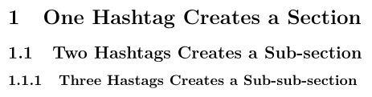

```{r setup, include = FALSE}
# This is the setup chunk. It can be used to setup general options and load
# packages that you make use of during the report.
knitr::opts_chunk$set(
  echo = TRUE,
  warning = FALSE,
  message = FALSE,
  fig.align = "center",
  fig.width = 2.5,
  fig.height = 2.2
)

library(tidyverse)

# set a theme for ggplot2
theme_set(theme_grey(base_size = 10))

options(
  digits = 3, # limit number of significant digits
  width = 63  # limit width of code
)
```

# A Syntax for Writing Documents

This document is written using [R Markdown](http://rmarkdown.rstudio.com). R
Markdown is a syntax for formatting documents that lets you focus on content.
You write text (including R code) in a standard text document with the ending
`.Rmd` and then your machine turns your text into a neatly formatted document. 

In addition, R Markdown documents can be compiled into a wide variety of
formats, including PDFs, Word Documents, and HTML pages (and much more) without
having to change the content on your document.

This document has in fact been rendered as both a [PDF
document](https://github.com/stat-lu/dataviz/raw/main/pages/introduction-to-rmarkdown.pdf)
and [html
page](https://stat-lu.github.io/dataviz/pages/introduction-to-rmarkdown). You
can choose any of these when following this guide, but we recommend reading the
PDF version to get a sense of what your output actually will look like (since
you'll be handing in PDF documents in this course).

Authoring your documents using R Markdown facilitates reproducibility. Because
you need to supply all the code used to produce your paper in the `.Rmd` file,
this makes it much easier for other people to re-run your analysis and use your
code. It also means that your paper is now automated. Should you need to update
or modify your data, for instance, you will typically be able to generate your
final document simply by re-knitting it after having made your changes.

As you proceed though this document, consider taking a look at the
[R Markdown source code for this document](
https://github.com/stat-lu/dataviz/blob/main/pages/introduction-to-rmarkdown.Rmd)
too, to get a better feel for what R Markdown documents look like.

# Getting Started

## Installation

To get started, you are going to need two packages: **rmarkdown** and **knitr**.
Run the following line of code to install these now. If you happen to be looking
at [the source
code](https://github.com/stat-lu/dataviz/blob/main/pages/introduction-to-rmarkdown.Rmd)
as you read this, you can simply highlight the text and hit `Ctrl/Cmd + Enter`
or put the cursor inside the code chunk below and hit `Ctrl/Cmd + Shift + Enter`
to run the command (and install the packages).

```{r, eval = FALSE}
install.packages(c("rmarkdown", "knitr"))
```

To produce PDF documents, you will also need a distribution of LaTeX. Installing
LaTeX is fortunately easy using the **tinytex** package. Do so now (unless you
already have a working installation of LaTeX on your computer) by calling the
following lines of code.

```{r, eval = FALSE}
install.packages("tinytex")
tinytex::install_tinytex()
```

After this, we also recommend that you set the options in `Tools > Global
Options > Sweave` in R Studio as in Figure 1.

{width=300px}

## Your First R Markdown Document

For this course, we have provided a R Markdown template that provides better
defaults for your documents than the built-in one. You can download it your
current working directory in R by calling the following lines.

```{r template, eval = FALSE}
download.file(
  "https://raw.githubusercontent.com/stat-lu/dataviz/main/resources/template.Rmd",
  "template.Rmd", # destination, you can replace this if you want
  mode = "wb"
)
```

Then open the `template.Rmd` file in RStudio.

## Knitting

Now that you have LaTeX installed, you can turn the R Markdown template into a
PDF by *knitting* it. To do so in R Studio, simply hit `Ctrl/Cmd + Shift + k`
with the file open.  Doing so will tell R to run through all of your code blocks
and text and pass this on to LaTeX to render your document into a PDF file,
which should open up on your screen. 

# YAML block

Each R Markdown file starts with a so called YAML block, such as this one:

```yaml
---
title: "An Awesome Title"
author: "Fantastic Me"
date: "2020-09-28"
output: pdf_document
---
```

The YAML block contains settings that control the title block (title, author,
date) and options for the layout. For this course, please use the YAML block
supplied in the template, modifying only the `author` and `title` fields. (The
`date` field in the template adds the current date automatically.)

# Formatting

R Markdown is an extension of [Pandoc
Markdown](https://pandoc.org/MANUAL.html#pandocs-markdown), which uses a
special---but very simple---syntax for formatting text.

First of all, a contiguous block of text is treated as a **paragraph**. Separate
paragraphs with blank lines. Formatting text in italics, bold font, or monospace
(fixed-width) fonts is accomplished by wrapping text with symbols (Table 1).

Table: Markdown text formatting.

Markdown                    Output
--------------------------  ---------------------------
`*italics*`                 *italics*
`**boldface**`              **boldface**
``typewriter (monospace)``  `typewriter (monospace)`

## Sections

Sections are created by prefacing the section title with a hash tag (`#`).

```
# One Hashtag Creates a Section

## Two Hashtags Creates a Sub-section

### Three Hastags Creates a Sub-sub-section

```

In Figure 2, we show what this looks like.

{width=250px}

## Lists

To create (unnumbered) lists in markdown, add a

```
- dash before each item in the list, and
  - indent each sub-item with two spaces.
* If you prefer, you can also use asterisks, and
  + plus signs (or a mix).
```

The output looks like this:

- dash before each item in the list, and
  - indent each sub-item with two spaces.
* If you prefer, you can also use asterisks, and
  + plus signs (or a mix).

Ordered lists are

```
1. created similarly, but
2. use numbers or letters instead of dashes.
   a) It's easy to add sub-items too!
```

The output looks like this:

1. created similarly, but
2. using numbers or letters instead of dashes.
   a) It's easy to add sub-items too!

## Tables

There are [many ways](https://pandoc.org/MANUAL#tables) to format tables in
markdown, but the simplest one is to simply create columns of text with dashes
(`---`) separating the title of each column from the cells of the table.

```
Table: A caption for the table can be added like this.

Header 1    Header 2
---------   ---------
Cell 1      Cell 2
Cell 3      Cell 4
```

Table 2 shows what the output looks like. 

Table: A caption for the table can be added like this.

Header 1    Header 2
---------   ---------
Cell 1      Cell 2
Cell 3      Cell 4

## Links

To add a link in Markdown, you can either simply surround the URL with angled
brackets (`<>`) or square brackets (`[]`) and parentheses (`()`) if you
want to replace the URL with a label (Table 3).

Table: Links in Markdown.

+------------------------------+----------------------------+
| Markdown                     | Output                     |
+==============================+============================+
| `<https://stat.lu.se>`       | <https://stat.lu.se>       |
+------------------------------+----------------------------+
| `[Link](https://stat.lu.se)` | [Link](https://stat.lu.se) |
+------------------------------+----------------------------+

## Images

Images can be added with syntax similar to the one for links, with the text
inside brackets indicating the caption for the figure. Provided that
we have stored a figure at `images/xkcd.png`, we can include it like this.

```
{width=300px}
```

Note the use of the exclamation mark at the start of the
code as well as the use of `{width=300px}` here to
specify the width of the image. The result is available in Figure 3. 

{width=300px}

## Footnotes

Footnotes can be useful to provide additional information. To create
a footnote, the simplest way is to write `^[Footnote]`, like this:

`This sentence has a footnote^[Additional information].`

In the output, it shows up like this:

This sentence has a footnote^[Additional information].

## Citations

It is possible to add citations in R Markdown but this is somewhat complicated
if you are not familiar with Markdown and Pandoc. You will not be needing a lot
of (or even any) references in this course, so it's perfectly alright to write
your references and citations manually; in this case, you can skip the next
paragraph.

To cite in R Markdown, you will need either 1) a `.bib` file (with
BibTeX-formatted references) somewhere in your working directory or 2) a
`references` field in the YAML block, like the following:

```
references:
- id: wickham2010
  title: A Layered Grammar of Graphics
  author:
    - family: Wickham
      given: Hadley
  issued:
    year: 2010
    month: 1
  container-title: Journal of computational and graphical statistics
  volume: 19
  issue: 1
  page: 3-28
  DOI: 10.1198/jcgs.2009.07098
  URL: http://www.tandfonline.com/doi/abs/10.1198/jcgs.2009.07098
  type: article-journal
```

Using a `.bib` file is recommended unless you only have a few references.

To cite something, find the key of the reference you are looking for---in this case
`wickham2010`---and preface it with an `@`. See the examples in Table 4.

Table: Citations in R Markdown.

Type                  Markdown                  Output
------------------    -------------------       --------------
text citation         `@wickham2010`            @wickham2010
indirect deference    `[@wickham2010]`          [@wickham2010]

If you've done everything right, the final document will get a
bibliography at the end (as in this one).

# Code Chunks

So far we've only really talked about features that are included in vanilla
Markdown^[To be precise, some of these features actually need Pandoc's flavor of
Markdown to work.]. But what makes R Markdown special is that is allows us to
include chunks of R code in our texts, have them be evaluated, and their output
included in the final document. Here is a simple example of a code chunk.

````
`r ''```{r}
x <- 3 + 9 
x
```
````

When we knit our document, the output looks like this:

```{r}
x <- 3 + 9 
x
```

As you can see, we've started the code chunk with ` ```{r} ` and ended it with `
``` `. Everything in between will be treated as R code, just as if you would
have written in in an R script or the R terminal. When you compile this
document, all this code will be run and if it produces any output (text, plot,
tables) then that output will make it into the final document. In addition,
all the code you include will receive pretty syntax highlighting.

## Figures

The primary reason for why R Markdown is so useful in this course is as a means
of getting our visualizations into a document. To produce a visualization in R
Markdown, simply write the code as you would have otherwise, knit the document,
and watch the magic happen. Here's an example.

````
`r ''```{r chode-chunk-label}
library(tidyverse)

ggplot(msleep, aes(brainwt, sleep_rem)) +
  geom_point() +
  scale_x_log10() +
  labs(x = "Brain Weight (lbs)", y = "REM Sleep (hours)")
```
````

The result is the formatted code and the figure.

```{r chode-chunk-label}
library(tidyverse)

ggplot(msleep, aes(brainwt, sleep_rem)) +
  geom_point() +
  scale_x_log10() +
  labs(x = "Brain Weight (lbs)", y = "REM Sleep (hours)")
```

The header of the code chunk (everything between `{r` and `}`) can be used to
specify settings that control the behavior and output of the code. The first
word after `r` is treated as the *label* of the code chunk. You don't need to
use labels at all^[They are mostly useful if you want to use some advanced
features like cross-referencing with the **bookdown** package, but this is
beyond our scope here.]. In particular, when we generate figures, the
`fig.width`, `fig.height`, and `fig.cap` options to set the dimensions of the
resulting figure as well as its caption.

In the following code chunk, we've used this to modify the size of the figure
and to add a descriptive caption.^[We've inserted a line break into the code
chunk header to avoid having it escape into the margin here, but be aware that
you cannot actually do this in your code.]

````
`r ''```{r brain-figure, fig.cap = "Brain weight and REM sleep 
duration for mammals.", fig.width = 4, fig.height = 1.5, echo = FALSE}
ggplot(msleep, aes(brainwt, sleep_rem)) +
  geom_point() +
  scale_x_log10() +
  labs(x = "Brain Weight (kg)", y = "REM Sleep (hours)")
```
````

```{r brain-figure, fig.cap = "Brain weight and REM sleep duration for mammals.", fig.width = 4, fig.height = 1.5, echo = FALSE}
ggplot(msleep, aes(brainwt, sleep_rem)) +
  geom_point() +
  scale_x_log10() +
  labs(x = "Brain Weight (kg)", y = "REM Sleep (hours)")
```

You can see the finished result in Figure 4.

## Tables

We've previously covered how to write tables in Markdown, but it's also possible
to use R Markdown to create tables directly from code and objects in R using
`knitr::kable()` (or `kableExtra::kbl()`, which is identical to the former
command but better documented).

Let's, for instance say we wanted to show the first few rows of some of the
variables in the `mpg` data set. Then we could do the following:

````
`r ''```{r kable-example, echo = FALSE}
library(ggplot2)

mpg %>%
  head(8) %>%
  select(1:6) %>%
  kableExtra::kbl(
    caption = "The first observations of the `mpg` data set.",
    booktabs = TRUE # nicer tables for PDF output
  )
```
````

```{r kable-example, echo = FALSE}
library(ggplot2)

mpg %>%
  head(8) %>%
  select(1:6) %>%
  kableExtra::kbl(
    caption = "The first observations of the `mpg` data set.",
    booktabs = TRUE # nicer tables for PDF output
  )
```

The result is shown in Table 5.

## Other Chunk Settings

There are a few other code chunk settings that
are useful to know about, namely `echo`, `eval`, and `include`.
Here are some examples of these arguments (note that `echo = TRUE`, `eval =
TRUE`, and `include = TRUE` are the defaults and hence need not be specified
unless we want to change them):

Use `echo = FALSE` when you want to hide the code but evaluate it
and show all output (like figures).

````
`r ''```{r echo = FALSE}
print("Hello World!")
```
````

```{r echo = FALSE}
print("Hello World!")
```

Use `eval = FALSE` when you want to show code but not have it be evaluated.

````
`r ''```{r eval = FALSE}
print("Hello World!")
```
````

```{r eval = FALSE}
print("Hello World!")
```

Use `include = FALSE` if you want the code to be evaluated but hide all output
(including figures).

````
`r ''```{r include = FALSE}
print("Hello World!")
```
````

```{r include = FALSE}
print("Hello World!")
```

## Global Chunk Settings

The chunk settings (defaults) for an R Markdown document can be modified
globally. To do so, you need to call the `knitr::opts_chunk$set()` function at
the top of your document. Inside the function, you set defaults for the various
chunk arguments. The following are the global settings for the template.

````
`r ''```{r setup, include = FALSE}
knitr::opts_chunk$set(
  echo = FALSE,
  warning = FALSE,
  message = FALSE,
  fig.align = "center",
  fig.width = 2.5,
  fig.height = 2.2
)
```
````

We use the settings `echo = FALSE`, `include = TRUE`, and `eval = TRUE` (the
latter two are the defaults so need not be specified) so that, by default, all
output, including figures, are shown in the document but no code.

The reason we use these defaults is that you most often will not
include your code in this course. It's easier then to use `echo = TRUE`
directly whenever you do need to do this. 

# Learning More

If you want to learn more about R Markdown, we recommend the [R Markdown
Cookbook](https://bookdown.org/yihui/rmarkdown-cookbook/install-latex.html). If
you run into any issues with R Markdown, please use the course's discussion
board on Canvas, search [stack overflow](https://stackoverflow.com) with the
`[r-markdown]` or `[knitr]` tag, or simply google it.

# Troubleshooting

Occasionally, there are a few hiccups to get started with R Markdown and they
mostly involve the LaTeX installation and computer systems where you as a user
don't have complete administrator rights. Here, we've listed a few of these
issues and remedies for them.

## Error: `'"pdflatex"' not found`

If you receive an error when knitting such as the following,

```
Error: Failed to compile Test.tex.
In addition: Warning message:
In system2(..., stdout = FALSE, stderr = FALSE) : '"pdflatex"' not found
Execution halted
```

then please try running `tinytex:::install_prebuilt()`.

If this doesn't help, take a look at
<https://github.com/yihui/tinytex/issues/103> to see if any of the suggested
solutions there may help.

## Error: `/usr/local/bin not writable`

If you are on Mac OS X, you may be getting the following error (or something
like it) when trying to run `tinytex::install_tinytex()`:

```shell
add_link_dir_dir: destination /usr/local/bin not writable,
no links from /Users/<user>/Library/TinyTeX/bin/x86_64-darwin.
tlmgr: An error has occurred. See above messages. Exiting.
```

In this case, try to run the following commands in your terminal:

```shell
sudo chown -R `whoami`:admin /usr/local/bin
```

followed by

```shell
~/Library/TinyTeX/bin/x86_64-darwin/tlmgr path add
```

If this doesn't work, have a look at
<https://github.com/yihui/tinytex/issues/24>, where this issue has been
discussed.

## I still cannot knit to PDF!

As a last resort, you can change the output from PDF to Word document instead
(but then you need to convert it to PDF before submitting).

In this case, change the output section in the YAML front matter to the
following:

```r
output:
  word_document:
    number_sections: true
```

# References
