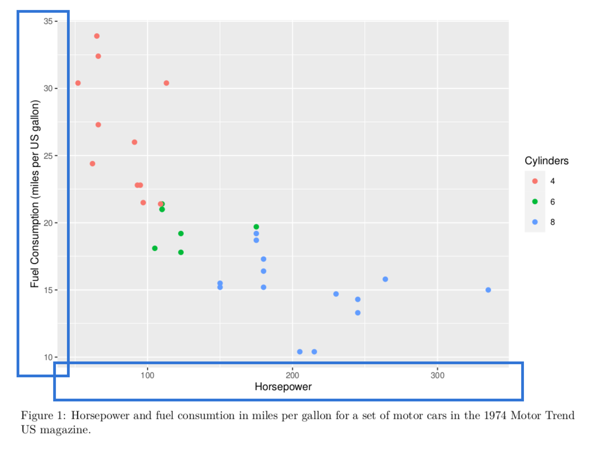

```{r setup, include=FALSE}

knitr::opts_chunk$set(
  echo = FALSE,
  message = FALSE,
  warning = FALSE,
  cache = FALSE,
  fig.align = "center",
  fig.width = 5,
  fig.height = 4,
  dev = "png"
)
options(scipen = 999)
```

To reason about visualizations we need to know a little bit about the anatomy of 
a plot and in this text we'll talk about some of the fundamental parts of a plot
so that you know the lingo that we'll be using extensively throughout this 
course.

To get going, we first need a plot to focus on. We'll use a simple plot of
horsepower versus fuel consumption from the `mtcars` dataset.

```{r}
knitr::include_graphics("images/anatomy.png")
```

To produce the plot, simply run the following code.

```{r anatomy, fig.cap = "Horsepower and fuel consumption. Each dot represents a motor car from the 1974 Motor Trend US magazine.", eval = FALSE, echo = TRUE}
library(tidyverse)

mtcars %>%
  mutate(cyl = as.factor(cyl)) %>%
  ggplot(aes(hp, mpg, color = cyl)) +
  geom_point() +
  labs(
    x = "Horsepower",
    y = "Fuel Consumption (miles per US gallon)",
    color = "Cylinders"
  )
```

## The Canvas 

```{r}
knitr::include_graphics("images/anatomy-canvas.png")
```

The canvas, also called the plot area, is the area on which the data is drawn. 
Everything outside of the canvas will be annotations and usually don't display
data directly.

If you use facets in your plot, you might have several canvasses
in a visualization. We'll discuss facets in detail later, but for now it's
sufficient that you think of facets as multiple plots that you line up one after
the other.

## Grid

```{r}
knitr::include_graphics("images/anatomy-grid.png")
```

Sometimes, as in the default ggplot2 theme, the canvas is divided into sections
by a grid. A grid often makes it easier to compare data points, especially when
they are far apart. Grids are particularly useful when there are few 
observations in a visualization.

Grids often have major and minor gridlines, which is also true for this plot,
although the difference is slight.

## Geoms

```{r}
knitr::include_graphics("images/anatomy-geoms.png")
```

The geoms in the plot are geometrical shapes that are used to draw data. Here we
are using points as our geoms.

## Axes

```{r}

```

The axes is a guide for the connection between the coordinates of the geoms
and the variables they are mapped to. Without the axes, we would only see the 
pattern of points and not the values these points represent.

On each axis there are numbers or words and they are connected via *ticks* or
*tickmarks* to the gridlines.

## Legends

```{r}
knitr::include_graphics("images/anatomy-legend.png")
```

A legend is a guide that helps you read an aesthetic mapped to a variable
in the plot. The legend in this plot links a color scale to the number of 
cylinders.

The legend is sometimes also called a *key*.

## Guide Titles

```{r}
knitr::include_graphics("images/anatomy-titles.png")
```

The guide titles describe the variables and often the units for the 
data.

